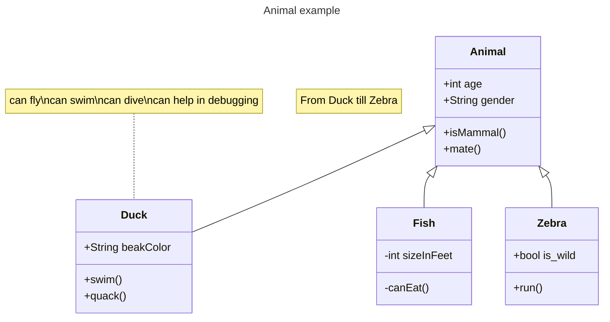

# TowerDefenseTemplate
Dit is een template wat door jullie te gebruiken is voor het juist inleveren van alle producten voor de Towerdefense beroepsopdracht. **Verwijder uiteindelijk de template teksten!**

Begin met een korte omschrijving van je towerdefense game en hoe deze werkt. Plaats ook een paar screenshots.

## Product 1: "DRY SRP Scripts op GitHub"

(https://github.com/AngelStruikenMA/TowerDefenseTemplate/blob/master/Tower%20defense/Assets/scripts/turret%20scripts/buildTower.cs))"*

## Product 2: "Projectmappen op GitHub"

Je commit de mappenstructuur van je unity project op github en verwijst vanuit je readme naar de root map van je project. Met een netjes en goed gestructureerde mappenstructuur en benamingen van files toon je aan dat je dit leerdoel beheerst. 

Zorg dat deze verwijst naar je Develop branch.

## Product 3: Build op Github

Je maakt in Unity een stabiele “build” van je game waarbij bugs en logs eerst zijn verwijderd. Deze buildfiles upload je in je repository onder releases.  Bij eventuele afwijkingen moeten deze worden gedocumenteerd in de release. (Bijv controller nodig of spelen via netwerk etc..) 

(https://github.com/erwinhenraat/TowerDefenseTemplate/releases)](https://github.com/AngelStruikenMA/TowerDefenseTemplate/releases/tag/builds)

## Product 4: Game met Sprites(animations) en Textures 

De build van je game bevat textures, sprites en sprite animations(bijv particles) die op de juiste manier zijn gebruikt en zorgen voor een goede afwerking van je game.  

Plaats in je readme een animated gif van je gameplay (+- 10 sec.) waarin de implementatie van je textures en sprites goed te zien is.

## Product 5: Issues met debug screenshots op GitHub 

Zodra je bugs tegenkomt maak je een issue aan op github. In de issue omschrijf je het probleem en je gaat proberen via breakpoints te achterhalen wat het probleem is. Je maakt screenshot(s) van het debuggen op het moment dat je via de debugger console ziet wat er mis is. Deze screenshots met daarbij uitleg over het probleem en de bijhorende oplossing post je in het bijhorende github issue. 
[[Hier de link naar mijn issues](https://github.com/erwinhenraat/TowerDefenseTemplate/issues/)
](https://github.com/AngelStruikenMA/prog-2.1/issues/1)
## Product 6: Game design met onderbouwing 

Je gebruikt een game design tool om je game design vast te leggen en te communiceren. Daarnaast onderbouw je de design keuzes ten aanzien van “playability” en “replayability” voor je game schriftelijk. 

Voorbeeld van een one page design:

Omschrijf per mechanic welke game design keuzes je hebt gemaakt en waarom je dit hebt gedaan.

*  **Je game bevat torens die kunnen mikken en schieten op een bewegend doel.** 
mijn game bevat toren die je kunt plaatsen en torens die schieten

*  **Je game bevat vernietigbare vijanden die 1 of meerderen paden kunnen volgen.**  

ik heb 1 type enemie die het volgt via waypoints en met een bepaald aantal hp zodat hij dood kunt gaan en wanneer de enemie bij het eind komt verlies je
*  **Je game bevat een “wave” systeem waarmee er onder bepaalde voorwaarden (tijd/vijanden op) nieuwe waves met vijanden het veld in komen.**

er spawnen in een keer een heleboel enemies

*  **Een “health” systeem waarmee je levens kunt verliezen als vijanden hun doel bereiken en zodoende het spel kunt verliezen.** 

je hebt 1 leven in mijn game als je die verlies heb je verloren

*  **Een “resource” systeem waarmee je resources kunt verdienen waarmee je torens kunt kopen en .evt upgraden.**

heb ik niet

*  **Een “upgrade” systeem om je torens te verbeteren.**

heb ik niet

*  **Een “movement prediction” systeem waarmee je kan berekenen waar een toren heen moeten schieten om een bewegend object te kunnen raken. (Moeilijk)**

heb ik niet

## Product 7: Class Diagram voor volledige codebase 

heb ik niet

## Product 8: Prototype test video
Je hebt een werkend prototype gemaakt om een idee te testen. Omschrijf if je readme wat het idee van de mechanics is geweest wat je wilde testen en laat een korte video van de gameplay test zien. 

## Product 9: SCRUM planning inschatting 

Je maakt een SCRUM planning en geeft daarbij een inschatting aan elke userstory d.m.v storypoints / zelf te bepalen eenheden. (bijv. Storypoints, Sizes of tijd) aan het begin van een nieuwe sprint update je deze inschatting per userstory. 

Plaats in de readme een link naar je trello en **zorg ervoor dat je deze openbaar maakt**

[Link naar de openbare trello](https://trello.com/b/w60wkKSU/examen-paraphrenia)

## Product 10: Gitflow conventions

Je hebt voor je eigen project in je readme gitflow conventies opgesteld en je hier ook aantoonbaar aan gehouden. 

De gitflow conventions gaan uit van een extra branch Develop naast de "Master"/"Main". Op de main worden alleen stabiele releases gezet.

Verder worden features op een daarvoor bedoelde feature banch ontwikkeld. Ook kun je gebruik maken van een hotfix brancg vanaf develop.

Leg hier uit welke branches jij gaat gebruiken en wat voor namen je hier aan gaat meegeven. Hoe vaak ga je comitten en wat voor commit messages wil je geven?

Meer info over het gebruiken van gitflow [hier](https://www.atlassian.com/git/tutorials/comparing-workflows/gitflow-workflow)

